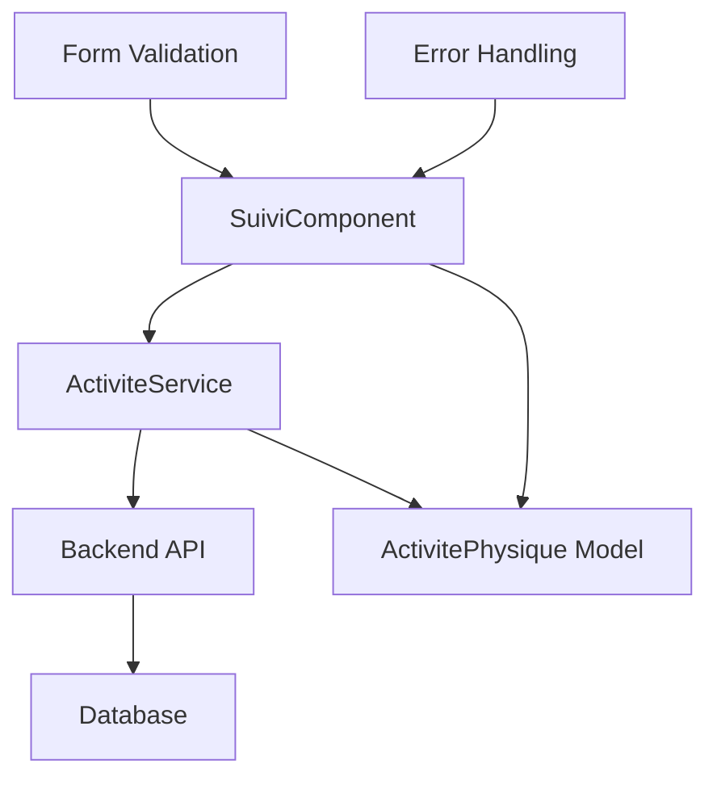

# Design Document: Activity Backend Integration Fix

## Overview

This design document outlines the solution to fix the integration between the Angular frontend and the backend API for physical activities. The current issue is a mismatch between the data fields sent by Angular and those expected by the backend, causing SQL errors when creating activities.

The solution involves updating the Angular models, services, and components to align with the backend API specification.

## Architecture

The fix involves three main layers:

1. **Data Layer**: Update TypeScript interfaces and models
2. **Service Layer**: Modify HTTP requests and response handling
3. **Component Layer**: Update form handling and data binding



## Components and Interfaces

### Updated ActivitePhysique Model

The model will be updated to match the backend schema exactly:

```typescript
export interface ActivitePhysique {
  id?: number;
  typeActivite: string;
  dureeMinutes: number;
  caloriesBrulees: number;
  intensite: 'FAIBLE' | 'MODEREE' | 'ELEVEE';
  dateActivite: string; // Format: YYYY-MM-DD
  notes?: string;
  utilisateur?: { id: number };
}

export interface CreerActiviteRequest {
  typeActivite: string;
  dureeMinutes: number;
  caloriesBrulees: number;
  intensite: 'FAIBLE' | 'MODEREE' | 'ELEVEE';
  dateActivite: string;
  notes?: string;
  utilisateur: { id: number };
}
```

### ActiviteService Updates

The service will be modified to:
- Send only backend-compatible fields
- Include proper user ID in requests
- Handle errors appropriately
- Calculate calories based on activity type and duration

### SuiviComponent Updates

The component will be updated to:
- Use the correct field names in forms
- Calculate calories before sending requests
- Include user ID from authentication
- Provide better error messages

## Data Models

### Request Payload Structure

The exact payload structure that will be sent to the backend:

```json
{
  "typeActivite": "Musculation",
  "dureeMinutes": 30,
  "caloriesBrulees": 250,
  "intensite": "MODEREE",
  "dateActivite": "2026-01-06",
  "notes": "Séance matinale",
  "utilisateur": { "id": 7 }
}
```

### Calorie Calculation Logic

Calories will be calculated based on activity type and intensity:

```typescript
const calorieRates = {
  'Course à pied': { FAIBLE: 8, MODEREE: 12, ELEVEE: 16 },
  'Marche': { FAIBLE: 3, MODEREE: 5, ELEVEE: 7 },
  'Vélo': { FAIBLE: 6, MODEREE: 10, ELEVEE: 14 },
  'Natation': { FAIBLE: 10, MODEREE: 14, ELEVEE: 18 },
  'Musculation': { FAIBLE: 6, MODEREE: 8, ELEVEE: 10 },
  // ... other activities
};
```

## Correctness Properties

*A property is a characteristic or behavior that should hold true across all valid executions of a system-essentially, a formal statement about what the system should do. Properties serve as the bridge between human-readable specifications and machine-verifiable correctness guarantees.*

### Property Reflection

After analyzing all acceptance criteria, several properties can be consolidated to avoid redundancy:
- Field validation properties (4.1, 4.2, 4.5) can be combined into a comprehensive validation property
- Error handling properties (5.1-5.4) are specific examples that should remain separate
- Request structure properties (2.1, 3.3) are similar but test different layers

### Core Properties

**Property 1: Model field compliance**
*For any* ActivitePhysique interface instance, it should contain exactly the required fields (typeActivite, dureeMinutes, caloriesBrulees, intensite, dateActivite, notes, utilisateur) and no obsolete fields (date, duree, type)
**Validates: Requirements 1.1, 1.2**

**Property 2: Intensity value restriction**
*For any* intensite field value, it should be one of: 'FAIBLE', 'MODEREE', 'ELEVEE'
**Validates: Requirements 1.3, 4.3**

**Property 3: Date format compliance**
*For any* dateActivite field value, it should follow the YYYY-MM-DD format
**Validates: Requirements 1.4, 4.4**

**Property 4: User object structure**
*For any* utilisateur field value, it should be an object containing an id property with a numeric value
**Validates: Requirements 1.5**

**Property 5: Request payload compliance**
*For any* activity creation request, the payload should contain only backend-compatible fields and include a valid utilisateur object
**Validates: Requirements 2.1, 2.4, 3.3**

**Property 6: HTTP headers compliance**
*For any* HTTP request to the activity API, it should include Content-Type: application/json headers
**Validates: Requirements 2.3**

**Property 7: Calorie calculation consistency**
*For any* activity type and duration combination, the calculated calories should be positive and based on the intensity multiplier
**Validates: Requirements 3.2**

**Property 8: Input validation compliance**
*For any* activity form input, typeActivite should be non-empty, dureeMinutes should be positive, and caloriesBrulees should be positive
**Validates: Requirements 4.1, 4.2, 4.5**

**Property 9: Error response handling**
*For any* HTTP error response, the system should display appropriate error messages and log complete error details
**Validates: Requirements 2.5, 3.5, 5.5**

**Property 10: Success flow completion**
*For any* successful activity creation, the system should display a success message and refresh the displayed data
**Validates: Requirements 3.4**

<function_calls>
<invoke name="prework">
<parameter name="featureName">activity-backend-integration-fix

## Error Handling

### HTTP Error Mapping

The system will handle different HTTP status codes with specific user-friendly messages:

- **400 Bad Request**: "Données invalides - Vérifiez les champs requis"
- **401 Unauthorized**: "Non autorisé - Veuillez vous reconnecter"
- **500 Internal Server Error**: "Erreur serveur - Veuillez réessayer plus tard"
- **Network Error**: "Impossible de contacter le serveur"

### Error Logging

All errors will be logged to the console with complete details for debugging purposes, including:
- HTTP status code
- Error message from backend
- Request payload that caused the error
- Stack trace when available

### Validation Errors

Client-side validation will prevent invalid data from being sent:
- Empty activity type
- Non-positive duration or calories
- Invalid intensity values
- Malformed dates

## Testing Strategy

### Unit Testing Approach

**Unit Tests**: Focus on specific components and functions
- Model validation functions
- Calorie calculation logic
- Error message formatting
- Form validation rules

**Property-Based Tests**: Verify universal properties across all inputs
- Model field compliance across random data
- Date format validation with generated dates
- Calorie calculation consistency with various inputs
- Error handling behavior with different error scenarios

### Property-Based Testing Configuration

- **Testing Library**: Angular Testing Library with fast-check for property-based testing
- **Test Iterations**: Minimum 100 iterations per property test
- **Test Tagging**: Each property test will reference its design document property

Example property test structure:
```typescript
// Feature: activity-backend-integration-fix, Property 1: Model field compliance
it('should maintain model field compliance', () => {
  fc.assert(fc.property(
    activityGenerator(),
    (activity) => {
      // Test that activity has required fields and no obsolete ones
    }
  ), { numRuns: 100 });
});
```

### Integration Testing

- Test complete flow from form submission to backend response
- Mock backend responses for different scenarios
- Verify JWT token inclusion in requests
- Test error handling with various HTTP status codes

### Manual Testing Checklist

1. Create activity with valid data → Should succeed with 200 OK
2. Create activity with missing fields → Should show validation errors
3. Create activity without authentication → Should show 401 error
4. Test with network disconnected → Should show network error
5. Verify activity appears in list after creation
6. Test activity deletion functionality