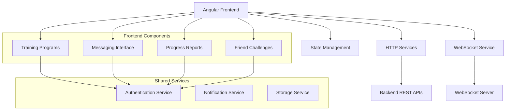

# Design Document

## Overview

This design document outlines the frontend implementation for four key user stories in the fitness application: Training Programs (US07), Integrated Messaging (US08), Progress Reports (US11), and Friend Challenges (US12). The solution leverages Angular's reactive architecture with RxJS, integrates with existing backend APIs, and implements real-time communication through WebSocket connections.

The design follows Angular best practices with a service-oriented architecture, reactive programming patterns, and responsive UI components that work seamlessly across desktop and mobile devices.

## Architecture

### High-Level Architecture



### Component Architecture

The application follows a hierarchical component structure with smart containers and dumb presentation components:

- **Container Components**: Handle business logic, API calls, and state management
- **Presentation Components**: Focus on UI rendering and user interactions
- **Shared Components**: Reusable UI elements across features

## Components and Interfaces

### Training Programs Module

#### ProgrammeManagementComponent (Container)
- Manages program creation, editing, and status updates
- Handles coach-client program assignments
- Integrates with ProgrammeService for API communication

#### ProgrammeListComponent (Presentation)
- Displays list of programs with filtering and sorting
- Shows program status, progress, and client information
- Provides quick actions for program management

#### ProgrammeFormComponent (Presentation)
- Form for creating and editing training programs
- Dynamic exercise addition with validation
- Date picker integration for program scheduling

#### ExerciseTrackerComponent (Presentation)
- Client-side exercise completion tracking
- Progress visualization with completion percentages
- Exercise details with sets, reps, and notes

### Messaging Module

#### MessagingContainerComponent (Container)
- Manages WebSocket connections and message state
- Handles conversation selection and message sending
- Integrates real-time notifications

#### ConversationListComponent (Presentation)
- Displays list of conversations with unread indicators
- Shows last message preview and timestamp
- Provides search and filtering capabilities

#### ChatWindowComponent (Presentation)
- Real-time message display with auto-scrolling
- Message input with typing indicators
- File attachment support and message status indicators

#### MessageBubbleComponent (Presentation)
- Individual message rendering with sender information
- Read status indicators and timestamp display
- Support for different message types (text, image, system)

### Progress Reports Module

#### ReportsManagementComponent (Container)
- Handles report generation and data compilation
- Manages coach recommendations and client feedback
- Integrates with multiple data sources (activities, nutrition, weight)

#### ReportViewerComponent (Presentation)
- Comprehensive report display with charts and metrics
- Interactive data visualization using Chart.js
- Export functionality for PDF generation

#### ReportFormComponent (Presentation)
- Form for creating custom reports with date ranges
- Client selection for coaches
- Template selection and customization options

### Friend Challenges Module

#### ChallengeManagementComponent (Container)
- Challenge creation, participation, and progress tracking
- Leaderboard management and ranking calculations
- Integration with activity tracking systems

#### ChallengeListComponent (Presentation)
- Display of active, completed, and available challenges
- Challenge filtering by type, status, and participation
- Quick join/leave actions

#### LeaderboardComponent (Presentation)
- Real-time leaderboard with participant rankings
- Progress visualization and achievement indicators
- Social sharing and motivation features

#### ChallengeFormComponent (Presentation)
- Challenge creation form with objective selection
- Participant invitation system
- Duration and target value configuration

## Data Models

### Enhanced Training Program Models

```typescript
export interface ProgrammeEntrainementDTO {
  id?: number;
  coachId: number;
  clientId: number;
  nomCoach?: string;
  nomClient?: string;
  nom: string;
  description?: string;
  dateDebut: LocalDate;
  dateFin?: LocalDate;
  exercices: ExerciceDTO[];
  statut: ProgramStatus;
  totalExercises: number;
  completedExercises: number;
  progressPercentage: number;
  createdAt: LocalDateTime;
  updatedAt?: LocalDateTime;
}

export interface ExerciceDTO {
  nom: string;
  description?: string;
  series: number;
  repetitions: number;
  dureeMinutes?: number;
  intensite?: 'FAIBLE' | 'MOYENNE' | 'ELEVEE' | 'MAXIMALE';
  notes?: string;
  completed?: boolean;
  completionDate?: LocalDateTime;
}

export interface ProgressDTO {
  programmeId: number;
  clientId: number;
  totalExercises: number;
  completedExercises: number;
  progressPercentage: number;
  lastActivity?: LocalDateTime;
}
```

### Messaging System Models

```typescript
export interface ConversationDTO {
  conversationId: string;
  autreUtilisateurId: number;
  autreUtilisateurNom: string;
  autreUtilisateurRole: string;
  dernierMessage: string;
  dateDernierMessage: LocalDateTime;
  messagesNonLus: number;
}

export interface MessageDTO {
  id?: number;
  expediteurId: number;
  expediteurNom: string;
  destinataireId: number;
  destinataireNom: string;
  contenu: string;
  dateEnvoi: LocalDateTime;
  dateLecture?: LocalDateTime;
  conversationId: string;
  estLu: boolean;
  type: MessageType;
}

export interface TypingIndicatorDTO {
  userId: number;
  username: string;
  isTyping: boolean;
}
```

### Progress Reports Models

```typescript
export interface RapportProgresDTO {
  id?: number;
  utilisateurId: number;
  coachId?: number;
  nomUtilisateur?: string;
  nomCoach?: string;
  dateDebutSemaine: LocalDate;
  dateFinSemaine: LocalDate;
  resume?: string;
  recommandations?: string;
  donneesCompilees: string; // JSON string
  dateGeneration: LocalDateTime;
  dateModification?: LocalDateTime;
}

export interface CompiledDataDTO {
  totalActivites: number;
  totalRepas: number;
  caloriesConsommees: number;
  caloriesBrulees: number;
  bilanCalorique: number;
  moyenneCaloriesParJour: number;
  totalDureeActivites: number;
  moyenneDureeParActivite: number;
  moyenneActivitesParJour: number;
  totalProteines: number;
  totalGlucides: number;
  totalLipides: number;
  pourcentageProteines: number;
  pourcentageGlucides: number;
  pourcentageLipides: number;
  joursAvecActivite: number;
  joursAvecRepas: number;
  objectifActiviteAtteint: boolean;
  objectifNutritionAtteint: boolean;
}
```

### Friend Challenges Models

```typescript
export interface DefiDTO {
  id?: number;
  createurId: number;
  createurNom: string;
  nom: string;
  description?: string;
  typeObjectif: string;
  valeurCible: number;
  dateDebut: LocalDate;
  dateFin: LocalDate;
  dateCreation: LocalDateTime;
  statut: string;
  nombreParticipants: number;
  participants: ParticipantDefiDTO[];
}

export interface ParticipantDefiDTO {
  id?: number;
  utilisateurId: number;
  utilisateurNom: string;
  progressionActuelle: number;
  statut: string;
  classement?: number;
  dateInscription: LocalDateTime;
  pourcentageProgression: number;
}

export interface ClassementDefiDTO {
  defiId: number;
  nomDefi: string;
  typeObjectif: string;
  valeurCible: number;
  classement: ParticipantDefiDTO[];
}
```##
 Correctness Properties

*A property is a characteristic or behavior that should hold true across all valid executions of a system-essentially, a formal statement about what the system should do. Properties serve as the bridge between human-readable specifications and machine-verifiable correctness guarantees.*

### Training Program Properties

**Property 1: Exercise form validation**
*For any* exercise data input, the form should accept valid exercise configurations (name, sets, repetitions) and reject invalid ones
**Validates: Requirements 1.2**

**Property 2: Program submission success feedback**
*For any* valid training program data, submitting the form should result in a success confirmation being displayed
**Validates: Requirements 1.3**

**Property 3: Program list display completeness**
*For any* set of coach programs, the program list should display all required information (name, client, status, dates)
**Validates: Requirements 1.4**

**Property 4: Status update reactivity**
*For any* program status change, the interface should reflect the new status immediately without page refresh
**Validates: Requirements 1.5**

**Property 5: Client program filtering**
*For any* client user, the programs page should display only programs assigned to that specific client
**Validates: Requirements 2.1**

**Property 6: Exercise completion tracking**
*For any* exercise marked as completed, the progress indicator should update to reflect the new completion state
**Validates: Requirements 2.3**

**Property 7: Program completion logic**
*For any* program where all exercises are completed, the program status should automatically update to completed
**Validates: Requirements 2.4**

**Property 8: Progress calculation accuracy**
*For any* program with exercises, the completion percentage should equal (completed exercises / total exercises) * 100
**Validates: Requirements 2.5**

### Messaging System Properties

**Property 9: Conversation list filtering**
*For any* user role (coach or client), the conversation list should display only conversations relevant to that user's relationships
**Validates: Requirements 3.1**

**Property 10: Real-time message delivery**
*For any* message sent through WebSocket, it should appear in the recipient's conversation immediately
**Validates: Requirements 3.2**

**Property 11: Message reception notification**
*For any* received message, a notification should be displayed and the conversation should update in real-time
**Validates: Requirements 3.3**

**Property 12: Read status management**
*For any* conversation viewed by a user, all messages in that conversation should be marked as read
**Validates: Requirements 3.4**

**Property 13: Typing indicator transmission**
*For any* typing event in a conversation, the typing indicator should be transmitted to the other participant via WebSocket
**Validates: Requirements 3.5**

### Progress Reports Properties

**Property 14: Data compilation completeness**
*For any* client data within a date range, the report should compile all available metrics (calories, activities, weight changes)
**Validates: Requirements 4.2**

**Property 15: Chart generation consistency**
*For any* report data, visual charts should be generated displaying all compiled metrics in a readable format
**Validates: Requirements 4.3**

**Property 16: Recommendation persistence**
*For any* recommendation added to a report, the changes should be saved and a notification should be sent to the client
**Validates: Requirements 4.4**

**Property 17: Report display formatting**
*For any* progress report, all metrics and recommendations should be displayed in a structured, readable format
**Validates: Requirements 4.5**

### Friend Challenges Properties

**Property 18: Challenge creation validation**
*For any* challenge creation form, all required fields (type, target, duration, participants) should be validated before submission
**Validates: Requirements 5.2**

**Property 19: Participation status tracking**
*For any* user joining a challenge, their participation status should update and progress tracking should begin immediately
**Validates: Requirements 5.3**

**Property 20: Leaderboard ranking accuracy**
*For any* challenge progress update, the leaderboard should recalculate rankings and display current positions correctly
**Validates: Requirements 5.4**

**Property 21: Challenge completion results**
*For any* challenge that reaches its end date, final results should be calculated and winners should be declared
**Validates: Requirements 5.5**

### User Experience Properties

**Property 22: Responsive layout adaptation**
*For any* screen size or device type, the interface should adapt to provide an optimal layout for that viewport
**Validates: Requirements 6.1**

**Property 23: Navigation consistency**
*For any* navigation action between features, the navigation patterns and visual feedback should remain consistent
**Validates: Requirements 6.2**

**Property 24: Action feedback provision**
*For any* user action (button click, form submission), appropriate feedback should be provided through loading states or messages
**Validates: Requirements 6.3**

**Property 25: Error message clarity**
*For any* error condition encountered, clear error messages with suggested solutions should be displayed to the user
**Validates: Requirements 6.4**

**Property 26: Offline graceful degradation**
*For any* network connectivity issue, the application should handle the situation gracefully and inform the user appropriately
**Validates: Requirements 6.5**

**Property 27: WebSocket connection management**
*For any* WebSocket connection failure, the system should attempt reconnection and handle connection state properly
**Validates: Requirements 7.5**

## Error Handling

### HTTP Error Handling Strategy

The application implements a comprehensive error handling strategy using Angular HTTP interceptors:

```typescript
@Injectable()
export class ErrorInterceptor implements HttpInterceptor {
  intercept(req: HttpRequest<any>, next: HttpHandler): Observable<HttpEvent<any>> {
    return next.handle(req).pipe(
      catchError((error: HttpErrorResponse) => {
        if (error.status === 401) {
          // Handle authentication errors
          this.authService.logout();
          this.router.navigate(['/login']);
        } else if (error.status === 403) {
          // Handle authorization errors
          this.notificationService.showError('Access denied');
        } else if (error.status >= 500) {
          // Handle server errors
          this.notificationService.showError('Server error. Please try again later.');
        }
        return throwError(error);
      })
    );
  }
}
```

### WebSocket Error Handling

WebSocket connections implement automatic reconnection with exponential backoff:

- Connection failures trigger automatic reconnection attempts
- Maximum retry attempts prevent infinite loops
- Connection status is communicated to users
- Graceful degradation when real-time features are unavailable

### Form Validation Error Handling

All forms implement comprehensive validation with user-friendly error messages:

- Real-time validation feedback
- Field-specific error messages
- Form-level validation summaries
- Accessibility-compliant error announcements

## Testing Strategy

### Unit Testing Approach

**Component Testing:**
- Test component initialization and lifecycle methods
- Verify template rendering with different data states
- Test user interaction handlers and event emissions
- Mock service dependencies for isolated testing

**Service Testing:**
- Test HTTP service methods with mock responses
- Verify error handling and retry logic
- Test WebSocket service connection management
- Validate data transformation and caching logic

**Pipe Testing:**
- Test custom pipes with various input scenarios
- Verify date formatting and localization
- Test calculation pipes for progress and statistics

### Property-Based Testing Approach

The application uses **fast-check** library for property-based testing in TypeScript/Angular environment. Each property-based test runs a minimum of 100 iterations to ensure comprehensive coverage.

**Form Validation Properties:**
- Generate random form data to test validation rules
- Verify that valid data passes validation
- Ensure invalid data is properly rejected

**Data Display Properties:**
- Generate random datasets to test component rendering
- Verify that all required information is displayed
- Test sorting and filtering functionality

**Real-time Communication Properties:**
- Generate random message scenarios to test WebSocket handling
- Verify message delivery and ordering
- Test connection recovery scenarios

**Progress Calculation Properties:**
- Generate random completion states to test progress calculations
- Verify percentage calculations are accurate
- Test edge cases like empty or fully completed programs

### Integration Testing Strategy

**End-to-End User Flows:**
- Complete user journeys from login to feature completion
- Cross-component communication testing
- Real API integration testing with test data

**WebSocket Integration:**
- Real-time message delivery testing
- Connection handling under various network conditions
- Multi-user scenario testing

**Responsive Design Testing:**
- Automated testing across different viewport sizes
- Touch interaction testing on mobile devices
- Accessibility compliance testing

### Testing Configuration

```typescript
// karma.conf.js configuration for property-based testing
module.exports = function(config) {
  config.set({
    frameworks: ['jasmine', '@angular-devkit/build-angular'],
    plugins: [
      require('karma-jasmine'),
      require('karma-chrome-headless'),
      require('@angular-devkit/build-angular/plugins/karma')
    ],
    client: {
      jasmine: {
        random: true,
        seed: '4321',
        stopOnSpecFailure: false
      }
    },
    customLaunchers: {
      ChromeHeadlessCI: {
        base: 'ChromeHeadless',
        flags: ['--no-sandbox', '--disable-web-security']
      }
    }
  });
};
```

The testing strategy ensures comprehensive coverage of both specific examples and universal properties, providing confidence in the application's correctness and reliability across all user scenarios.