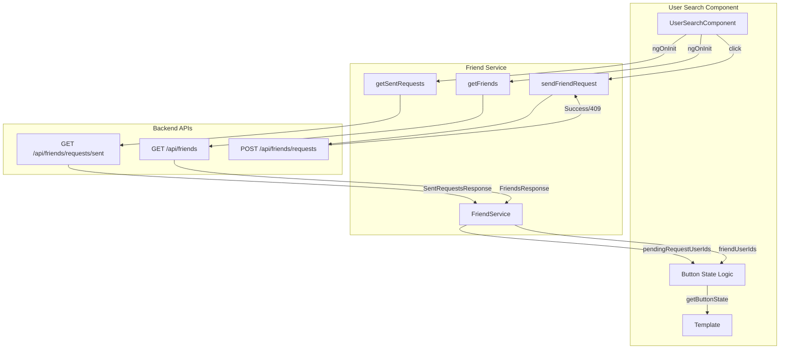

# Design Document

## Overview

Cette conception détaille les modifications nécessaires au frontend Angular pour corriger le comportement de la recherche d'amis. L'objectif est de charger proactivement les demandes d'amitié envoyées et la liste d'amis, puis d'utiliser ces données pour afficher le bouton approprié pour chaque utilisateur dans les résultats de recherche.

## Architecture



## Components and Interfaces

### Friend Service Extensions

Le service `FriendService` sera étendu avec de nouvelles méthodes et interfaces pour supporter la vérification des demandes existantes.

```typescript
// Nouvelles interfaces pour les réponses API
export interface FriendRequestItem {
  id: number;
  senderId: number;
  receiverId: number;
  status: string;
  createdAt: string;
}

export interface SentRequestsResponse {
  requests: FriendRequestItem[];
  count: number;
}

export interface PendingRequestsResponse {
  requests: FriendRequestItem[];
  count: number;
}

export interface FriendItem {
  id: number;
  nom: string;
  email: string;
  photo?: string;
}

export interface FriendsResponse {
  friends: FriendItem[];
  count: number;
}

// Nouvelles méthodes du service
getSentRequests(): Observable<SentRequestsResponse> {
  const headers = this.createAuthHeaders();
  return this.http.get<SentRequestsResponse>(
    `${this.apiUrl}/friends/requests/sent`, 
    { headers }
  );
}

getReceivedRequests(): Observable<PendingRequestsResponse> {
  const headers = this.createAuthHeaders();
  return this.http.get<PendingRequestsResponse>(
    `${this.apiUrl}/friends/requests/received`, 
    { headers }
  );
}

getFriendsList(): Observable<FriendsResponse> {
  const headers = this.createAuthHeaders();
  return this.http.get<FriendsResponse>(
    `${this.apiUrl}/friends`, 
    { headers }
  );
}
```

### User Search Component Extensions

Le composant `UserSearchComponent` sera étendu avec la logique de gestion d'état des boutons.

```typescript
// Nouvelles propriétés
pendingRequestUserIds: Set<number> = new Set();
friendUserIds: Set<number> = new Set();
isLoadingState: boolean = true;

// Méthode de détermination de l'état du bouton
getButtonState(userId: number): 'add' | 'pending' | 'friend' {
  if (this.friendUserIds.has(userId)) return 'friend';
  if (this.pendingRequestUserIds.has(userId)) return 'pending';
  return 'add';
}

// Chargement des demandes envoyées
loadPendingRequests(): void {
  this.friendService.getSentRequests().subscribe({
    next: (response) => {
      this.pendingRequestUserIds = new Set(
        response.requests.map(r => r.receiverId)
      );
    },
    error: (err) => {
      console.error('Erreur chargement demandes:', err);
      this.pendingRequestUserIds = new Set();
    }
  });
}

// Chargement des amis
loadFriends(): void {
  this.friendService.getFriendsList().subscribe({
    next: (response) => {
      this.friendUserIds = new Set(
        response.friends.map(f => f.id)
      );
    },
    error: (err) => {
      console.error('Erreur chargement amis:', err);
      this.friendUserIds = new Set();
    }
  });
}
```

## Data Models

### État du bouton

| État | Condition | Bouton affiché | Activé |
|------|-----------|----------------|--------|
| `add` | userId ∉ friendUserIds ∧ userId ∉ pendingRequestUserIds | "Ajouter" | Oui |
| `pending` | userId ∈ pendingRequestUserIds | "Demande envoyée" | Non |
| `friend` | userId ∈ friendUserIds | "Déjà amis" | Non |

### Réponses HTTP 409

| Code | Signification | Action frontend |
|------|---------------|-----------------|
| `REQUEST_PENDING` | Demande déjà envoyée | Ajouter à pendingRequestUserIds |
| `ALREADY_FRIENDS` | Déjà amis | Ajouter à friendUserIds |
| Autre | Erreur générique | Afficher message d'erreur |

## Correctness Properties

*A property is a characteristic or behavior that should hold true across all valid executions of a system-essentially, a formal statement about what the system should do. Properties serve as the bridge between human-readable specifications and machine-verifiable correctness guarantees.*

### Property 1: Button state consistency with friend list

*For any* user ID that exists in the friendUserIds Set, the getButtonState function SHALL return 'friend'

**Validates: Requirements 3.2**

### Property 2: Button state consistency with pending requests

*For any* user ID that exists in the pendingRequestUserIds Set but not in friendUserIds, the getButtonState function SHALL return 'pending'

**Validates: Requirements 3.3**

### Property 3: Default button state for unknown users

*For any* user ID that exists in neither friendUserIds nor pendingRequestUserIds, the getButtonState function SHALL return 'add'

**Validates: Requirements 3.4**

### Property 4: Friend status takes precedence over pending status

*For any* user ID that exists in both friendUserIds and pendingRequestUserIds, the getButtonState function SHALL return 'friend' (friend status has higher priority)

**Validates: Requirements 3.2, 3.3**

### Property 5: State update after successful request

*For any* successful friend request to a user ID, that user ID SHALL be added to pendingRequestUserIds and getButtonState SHALL return 'pending' for that user

**Validates: Requirements 5.1, 5.2**

### Property 6: State update on HTTP 409 REQUEST_PENDING

*For any* friend request that returns HTTP 409 with code 'REQUEST_PENDING', the user ID SHALL be added to pendingRequestUserIds

**Validates: Requirements 4.1**

### Property 7: State update on HTTP 409 ALREADY_FRIENDS

*For any* friend request that returns HTTP 409 with code 'ALREADY_FRIENDS', the user ID SHALL be added to friendUserIds

**Validates: Requirements 4.2**

## Error Handling

### Erreurs de chargement initial

- Si GET /api/friends/requests/sent échoue → initialiser pendingRequestUserIds à Set vide, logger l'erreur
- Si GET /api/friends échoue → initialiser friendUserIds à Set vide, logger l'erreur
- L'interface reste fonctionnelle avec des Sets vides (comportement dégradé)

### Erreurs d'envoi de demande

- HTTP 409 avec code connu → mettre à jour l'état local, afficher message informatif
- HTTP 409 avec code inconnu → afficher le message d'erreur du backend
- Autres erreurs HTTP → afficher message d'erreur générique

### Messages utilisateur

| Situation | Type | Message |
|-----------|------|---------|
| Demande envoyée avec succès | Success | "Demande envoyée !" |
| Demande déjà en attente (409) | Info | "Demande déjà envoyée" |
| Déjà amis (409) | Info | "Vous êtes déjà amis" |
| Erreur générique | Error | Message du backend ou "Erreur lors de l'envoi" |

## Testing Strategy

### Unit Tests

Les tests unitaires couvriront :
- La logique de `getButtonState()` avec différentes combinaisons d'états
- Le parsing des réponses API
- La gestion des erreurs HTTP 409

### Property-Based Tests

Les tests basés sur les propriétés utiliseront fast-check pour valider :
- La cohérence de l'état des boutons avec les Sets
- La priorité du statut ami sur le statut pending
- La mise à jour correcte des états après les actions

Configuration :
- Bibliothèque : fast-check
- Minimum 100 itérations par test
- Tag format : **Feature: friend-search-fix, Property {number}: {property_text}**
