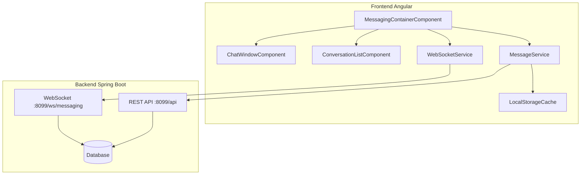

# Design Document - Messaging Backend Integration

## Overview

Ce document décrit l'architecture et le design technique pour l'intégration du système de messagerie Angular avec le backend Spring Boot. L'implémentation utilise une approche hybride REST/WebSocket pour assurer la fiabilité et le temps réel.

Le système utilise:
- **REST API** (`http://localhost:8099/api`) pour les opérations CRUD et la récupération de données
- **WebSocket avec SockJS/STOMP** (`http://localhost:8099/ws/messaging`) pour la communication temps réel
- **File d'attente locale** pour la gestion des messages hors ligne

## Architecture



## Components and Interfaces

### 1. MessageService (Service HTTP)

Service responsable des appels REST API pour la messagerie.

```typescript
interface MessageService {
  // Configuration
  readonly apiUrl: string; // 'http://localhost:8099/api'
  
  // Conversations
  getConversations(userId: number): Observable<ConversationDTO[]>;
  getConversationHistory(userId: number, otherUserId: number): Observable<MessageDTO[]>;
  getConversationHistoryPaginated(userId: number, otherUserId: number, page: number, size: number): Observable<PagedResponse<MessageDTO>>;
  
  // Messages
  sendMessage(userId: number, request: SendMessageRequest): Observable<MessageDTO>;
  markMessageAsRead(messageId: number, userId: number): Observable<void>;
  markConversationAsRead(conversationId: string, userId: number): Observable<void>;
  
  // Unread count
  getUnreadCount(userId: number): Observable<{ count: number }>;
  getUnreadMessages(userId: number): Observable<MessageDTO[]>;
  
  // Search
  searchMessages(userId: number, keyword: string): Observable<MessageDTO[]>;
}
```

### 2. WebSocketService (Service Temps Réel)

Service gérant la connexion WebSocket via SockJS et STOMP.

```typescript
interface WebSocketService {
  // Configuration
  readonly wsUrl: string; // 'http://localhost:8099/ws/messaging'
  
  // Connection
  connect(token: string, userId: number): void;
  disconnect(): void;
  isConnected(): boolean;
  connectionStatus$: Observable<ConnectionStatus>;
  
  // Subscriptions (auto-subscribed on connect)
  messages$: Observable<MessageDTO>;           // /user/{userId}/queue/messages
  messageSent$: Observable<MessageDTO>;        // /user/{userId}/queue/message-sent
  messageRead$: Observable<ReadReceipt>;       // /user/{userId}/queue/message-read
  typing$: Observable<TypingIndicator>;        // /user/{userId}/queue/typing
  
  // Publishing
  sendMessage(request: SendMessageRequest): void;      // /app/message.send
  markAsRead(messageId: number, senderId: number): void; // /app/message.read
  sendTypingIndicator(recipientId: number, isTyping: boolean): void; // /app/typing
}

type ConnectionStatus = 'connected' | 'disconnected' | 'connecting' | 'reconnecting';
```

### 3. MessagingContainerComponent

Composant principal orchestrant l'interface de messagerie.

```typescript
interface MessagingContainerState {
  conversations: ConversationDTO[];
  selectedConversationId: string | null;
  messages: MessageDTO[];
  loading: boolean;
  error: string | null;
  connectionStatus: ConnectionStatus;
  typingUsers: Map<number, boolean>;
  unreadCount: number;
  searchQuery: string;
  searchResults: MessageDTO[];
}
```

## Data Models

### Request/Response DTOs

```typescript
// Envoi de message - Request
interface SendMessageRequest {
  destinataireId: number;
  contenu: string;
  type: 'TEXT' | 'IMAGE' | 'FILE';
}

// Message - Response
interface MessageDTO {
  id: number;
  senderId: number;
  senderName: string;
  receiverId: number;
  receiverName: string;
  content: string;
  timestamp: string; // ISO 8601
  type: 'TEXT' | 'IMAGE' | 'FILE' | 'SYSTEM';
  isRead: boolean;
  conversationId: string;
}

// Conversation - Response
interface ConversationDTO {
  id: number;
  userId: number;
  userName: string;
  lastMessageContent: string;
  lastMessageAt: string; // ISO 8601
  unreadMessageCount: number;
}

// Typing Indicator
interface TypingIndicator {
  userId: number;
  username: string;
  typing: boolean;
}

// Read Receipt
interface ReadReceipt {
  messageId: number;
  readBy: number;
  readAt: string;
}

// Paginated Response
interface PagedResponse<T> {
  content: T[];
  totalElements: number;
  totalPages: number;
  page: number;
  size: number;
}
```

### WebSocket Message Formats

```typescript
// Message envoyé via /app/message.send
interface WsSendMessage {
  destinataireId: number;
  contenu: string;
  type: 'TEXT' | 'IMAGE' | 'FILE';
}

// Message reçu via /user/{userId}/queue/messages
interface WsReceivedMessage extends MessageDTO {}

// Typing via /app/typing
interface WsTypingRequest {
  destinataireId: number;
  typing: boolean;
}

// Read receipt via /app/message.read
interface WsReadRequest {
  messageId: number;
  expediteurId: number;
}
```

## Correctness Properties

*A property is a characteristic or behavior that should hold true across all valid executions of a system—essentially, a formal statement about what the system should do. Properties serve as the bridge between human-readable specifications and machine-verifiable correctness guarantees.*

### Property 1: JWT Token Inclusion in HTTP Requests

*For any* HTTP request made by the MessageService, the request headers SHALL contain an `Authorization` header with the format `Bearer {token}` where token is the current JWT token.

**Validates: Requirements 1.3**

### Property 2: Message Validation

*For any* message content string, if the length exceeds 2000 characters, the sendMessage function SHALL reject the message and return a validation error without making an API call.

**Validates: Requirements 2.6**

### Property 3: Conversation Sorting

*For any* list of conversations returned by getConversations, the conversations SHALL be sorted by `lastMessageAt` in descending order (most recent first).

**Validates: Requirements 3.2**

### Property 4: Message Queue Persistence

*For any* message that fails to send due to network unavailability, the message SHALL be added to the local queue, and when the network is restored, all queued messages SHALL be sent in FIFO order.

**Validates: Requirements 2.5, 10.1, 10.2**

### Property 5: Retry Limit Enforcement

*For any* queued message, if sending fails 3 consecutive times, the message SHALL be marked as 'failed' and removed from the automatic retry queue.

**Validates: Requirements 10.3**

### Property 6: Unread Count Consistency

*For any* conversation, the unreadMessageCount SHALL equal the number of messages in that conversation where isRead is false and senderId is not the current user.

**Validates: Requirements 3.4, 5.3, 8.3, 8.4**

### Property 7: Exponential Backoff Reconnection

*For any* WebSocket disconnection, the reconnection attempts SHALL follow exponential backoff with delays of 1s, 2s, 4s, 8s, 16s, up to a maximum of 30 seconds.

**Validates: Requirements 6.6**

### Property 8: Typing Indicator Debounce

*For any* typing event, if no keystroke occurs for 2 seconds, a typing:false indicator SHALL be sent. Additionally, received typing indicators SHALL be automatically hidden after 3 seconds without update.

**Validates: Requirements 7.2, 7.4**

### Property 9: Search Result Highlighting

*For any* search result, the search keyword SHALL appear highlighted (wrapped in a highlight element) within the displayed message content.

**Validates: Requirements 9.4**

### Property 10: Error Message Localization

*For any* error displayed to the user, the error message SHALL be in French.

**Validates: Requirements 10.4**

## Error Handling

### HTTP Error Handling

| Error Code | Scenario | User Message | Action |
|------------|----------|--------------|--------|
| 400 | Invalid request / Unauthorized recipient | "Vous ne pouvez pas envoyer de message à cet utilisateur" | Show error, don't retry |
| 401 | Token expired | "Session expirée, veuillez vous reconnecter" | Redirect to login |
| 403 | Forbidden | "Accès non autorisé" | Show error |
| 404 | Conversation not found | "Conversation introuvable" | Show error |
| 500 | Server error | "Erreur serveur, veuillez réessayer" | Allow retry |
| Network | No connection | "Connexion perdue, message en attente" | Queue message |

### WebSocket Error Handling

| Event | Action |
|-------|--------|
| Connection failed | Fallback to REST polling, show "Mode hors ligne" |
| Disconnected | Start reconnection with exponential backoff |
| Message send failed | Queue message, show pending indicator |
| Heartbeat timeout | Force reconnect |

## Testing Strategy

### Unit Tests

Unit tests will cover:
- Service method behavior with mocked HTTP responses
- State management in components
- Error handling scenarios
- Input validation

### Property-Based Tests

Property-based tests will use **fast-check** library for TypeScript to verify:
- JWT token inclusion in all requests (Property 1)
- Message validation (Property 2)
- Conversation sorting (Property 3)
- Message queue behavior (Properties 4, 5)
- Unread count consistency (Property 6)
- Exponential backoff timing (Property 7)
- Typing indicator timing (Property 8)

Each property test will run a minimum of 100 iterations with randomly generated inputs.

Test annotation format:
```typescript
// Feature: messaging-backend-integration, Property 1: JWT Token Inclusion
// Validates: Requirements 1.3
```

### Integration Tests

Integration tests will verify:
- End-to-end message flow (send → receive → display)
- WebSocket connection lifecycle
- Offline/online transitions
- Search functionality
