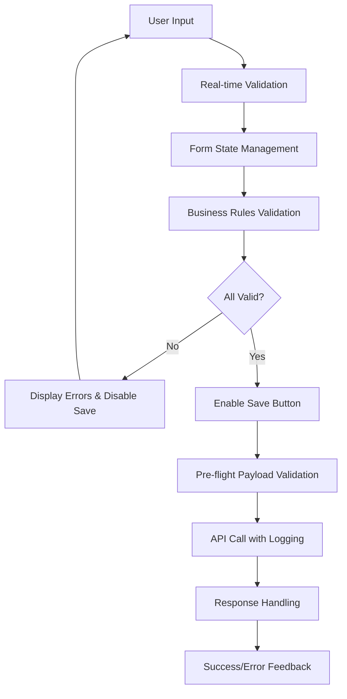

# Design Document: Profile Validation Fix

## Overview

This design implements a comprehensive client-side validation system for the user profile component to prevent 400 Bad Request errors when communicating with the Spring Boot backend. The solution focuses on validating all data before API calls, providing real-time feedback, and ensuring exact compatibility with backend validation constraints.

## Architecture

The validation system follows a layered approach:

1. **Form Validation Layer**: Real-time field validation with immediate feedback
2. **Business Logic Layer**: Profile-specific validation rules and constraints
3. **API Communication Layer**: Pre-flight validation and payload verification
4. **Error Handling Layer**: Comprehensive error mapping and user feedback



## Components and Interfaces

### Enhanced Profile Component

The `ProfileComponent` will be enhanced with:

```typescript
interface ValidationState {
  isValid: boolean;
  errors: ValidationErrors;
  fieldStates: FieldValidationState[];
}

interface ValidationErrors {
  age?: string;
  taille?: string;
  poids?: string;
  sexe?: string;
  objectif?: string;
  niveauActivite?: string;
  general?: string;
}

interface FieldValidationState {
  fieldName: string;
  isValid: boolean;
  errorMessage?: string;
  isDirty: boolean;
}
```

### Validation Service

A new `ProfileValidationService` will handle all validation logic:

```typescript
interface ProfileValidationService {
  validateProfile(profile: UserProfile): ValidationResult;
  validateField(fieldName: string, value: any): FieldValidationResult;
  validateNumericField(value: number, min: number, fieldName: string): FieldValidationResult;
  validateEnumField(value: string, allowedValues: string[], fieldName: string): FieldValidationResult;
  isProfileValid(profile: UserProfile): boolean;
  getValidationErrors(profile: UserProfile): ValidationErrors;
}
```

### Enhanced Profile Service

The existing `ProfileService` will be enhanced with:

```typescript
interface EnhancedProfileService extends ProfileService {
  validateAndSaveProfile(profile: UserProfile): Observable<UserProfile>;
  logPayload(payload: UserProfile): void;
  mapBackendErrors(error: any): ValidationErrors;
}
```

## Data Models

### Validation Configuration

```typescript
interface ValidationConfig {
  numericFields: {
    age: { min: 1, max: 120 };
    taille: { min: 50, max: 250 }; // cm
    poids: { min: 20, max: 300 }; // kg
  };
  enumFields: {
    sexe: ['HOMME', 'FEMME', 'AUTRE'];
    objectif: ['PERTE_POIDS', 'PRISE_MASSE', 'MAINTIEN', 'REMISE_EN_FORME'];
    niveauActivite: ['SEDENTAIRE', 'LEGER', 'MODERE', 'INTENSE', 'TRES_INTENSE'];
  };
  requiredFields: ['age', 'sexe', 'taille', 'poids', 'objectif', 'niveauActivite'];
}
```

### Enhanced UserProfile

The existing UserProfile interface will be used with additional validation metadata:

```typescript
interface ValidatedUserProfile extends UserProfile {
  _validationState?: ValidationState;
  _lastValidated?: Date;
}
```

## Correctness Properties

*A property is a characteristic or behavior that should hold true across all valid executions of a system-essentially, a formal statement about what the system should do. Properties serve as the bridge between human-readable specifications and machine-verifiable correctness guarantees.*

### Property Reflection

After analyzing all acceptance criteria, several properties can be consolidated to avoid redundancy:
- Properties 1.1, 1.2, 1.3 can be combined into a single numeric validation property
- Properties 2.1, 2.2, 2.3 can be combined into a single enum validation property  
- Properties 3.1, 3.2 can be combined into a single button state property
- Properties 6.3, 6.4 can be combined into a single error message state transition property

### Core Properties

**Property 1: Numeric Field Validation**
*For any* numeric profile field (age, taille, poids) and any input value, the validation system should accept values greater than 0 and reject values less than or equal to 0
**Validates: Requirements 1.1, 1.2, 1.3**

**Property 2: Enum Field Validation**
*For any* enum profile field (sexe, objectif, niveauActivite) and any input value, the validation system should accept only values that exactly match the corresponding backend enum constants
**Validates: Requirements 2.1, 2.2, 2.3**

**Property 3: Form Submission Prevention**
*For any* profile with invalid data (numeric fields ≤ 0 or null enum fields), the form submission should be prevented and the save button should be disabled
**Validates: Requirements 1.4, 2.4, 3.1**

**Property 4: Save Button State Management**
*For any* profile form state, the save button should be enabled if and only if all validation rules pass
**Validates: Requirements 3.2**

**Property 5: Error Message Display**
*For any* invalid field, the validation system should display a specific error message, and for any valid field, no error message should be displayed
**Validates: Requirements 1.5, 2.5, 3.3**

**Property 6: Error Message State Transitions**
*For any* field that changes from invalid to valid or valid to invalid, the error message display should update immediately to reflect the new state
**Validates: Requirements 3.4, 6.3, 6.4**

**Property 7: Real-time Validation**
*For any* field modification (numeric on blur, enum on selection), validation should execute immediately and update the field state
**Validates: Requirements 6.1, 6.2**

**Property 8: Comprehensive Logging**
*For any* profile save operation, the system should log the complete payload before API call, and log validation errors when validation fails
**Validates: Requirements 4.1, 4.2, 4.3, 4.4**

**Property 9: API Endpoint Consistency**
*For any* profile save operation (creation or update), the system should use only the PUT /api/profile endpoint
**Validates: Requirements 7.1**

**Property 10: Payload Data Type Consistency**
*For any* profile payload, numeric values should be sent as numbers and enum values should exactly match backend constants
**Validates: Requirements 7.2, 7.3**

**Property 11: Request Header Completeness**
*For any* API request, all required headers including authentication tokens should be included
**Validates: Requirements 7.4**

**Property 12: Payload Structure Validation**
*For any* constructed payload, the structure should exactly match the backend UserProfile model
**Validates: Requirements 7.5**

<function_calls>
<invoke name="prework">
<parameter name="featureName">profile-validation-fix

## Implementation Strategy

### Validation Service Implementation

The `ProfileValidationService` will implement a rule-based validation system:

```typescript
@Injectable({
  providedIn: 'root'
})
export class ProfileValidationService {
  private validationConfig: ValidationConfig = {
    numericFields: {
      age: { min: 1, max: 120 },
      taille: { min: 50, max: 250 },
      poids: { min: 20, max: 300 }
    },
    enumFields: {
      sexe: ['HOMME', 'FEMME', 'AUTRE'],
      objectif: ['PERTE_POIDS', 'PRISE_MASSE', 'MAINTIEN', 'REMISE_EN_FORME'],
      niveauActivite: ['SEDENTAIRE', 'LEGER', 'MODERE', 'INTENSE', 'TRES_INTENSE']
    },
    requiredFields: ['age', 'sexe', 'taille', 'poids', 'objectif', 'niveauActivite']
  };

  validateProfile(profile: UserProfile): ValidationResult {
    // Implementation details
  }
}
```

### Component Enhancement Strategy

The `ProfileComponent` will be enhanced with:

1. **Real-time Validation**: Field validation on blur/change events
2. **State Management**: Reactive form state tracking
3. **Error Display**: Dynamic error message rendering
4. **Button Control**: Save button enable/disable logic
5. **Logging Integration**: Comprehensive operation logging

### Error Handling Strategy

A multi-layered error handling approach:

1. **Client-side Validation**: Prevent invalid data submission
2. **API Error Mapping**: Map backend errors to form fields
3. **User-friendly Messages**: Clear, actionable error messages
4. **Fallback Handling**: Graceful degradation for unknown errors

## Error Handling

### Error Types and Responses

| Error Type | HTTP Status | Frontend Response |
|------------|-------------|-------------------|
| Validation Error | 400 | Map to specific fields, show field errors |
| Authentication Error | 401 | Prompt re-authentication |
| Network Error | 0 | Show connectivity message |
| Server Error | 500 | Show generic error with support info |
| Unknown Error | Any | Show fallback message |

### Error Message Templates

```typescript
const ERROR_MESSAGES = {
  age: {
    required: 'L\'âge est requis',
    min: 'L\'âge doit être supérieur à 0',
    max: 'L\'âge doit être inférieur à 120'
  },
  taille: {
    required: 'La taille est requise',
    min: 'La taille doit être supérieure à 50 cm',
    max: 'La taille doit être inférieure à 250 cm'
  },
  poids: {
    required: 'Le poids est requis',
    min: 'Le poids doit être supérieur à 20 kg',
    max: 'Le poids doit être inférieur à 300 kg'
  },
  sexe: {
    required: 'Le sexe est requis',
    invalid: 'Veuillez sélectionner: Homme, Femme ou Autre'
  },
  objectif: {
    required: 'L\'objectif est requis',
    invalid: 'Veuillez sélectionner un objectif valide'
  },
  niveauActivite: {
    required: 'Le niveau d\'activité est requis',
    invalid: 'Veuillez sélectionner un niveau d\'activité valide'
  }
};
```

## Testing Strategy

### Dual Testing Approach

The testing strategy combines unit tests and property-based tests for comprehensive coverage:

- **Unit Tests**: Verify specific examples, edge cases, and error conditions
- **Property Tests**: Verify universal properties across all inputs using fast-check library
- **Integration Tests**: Test component-service interactions and API communication

### Property-Based Testing Configuration

Each property test will run a minimum of 100 iterations using the fast-check library. Tests will be tagged with comments referencing their design document properties:

```typescript
// Feature: profile-validation-fix, Property 1: Numeric Field Validation
it('should validate numeric fields correctly for all inputs', () => {
  fc.assert(fc.property(
    fc.record({
      age: fc.integer(),
      taille: fc.integer(), 
      poids: fc.integer()
    }),
    (profile) => {
      const result = validationService.validateProfile(profile);
      const shouldBeValid = profile.age > 0 && profile.taille > 0 && profile.poids > 0;
      expect(result.isValid).toBe(shouldBeValid);
    }
  ), { numRuns: 100 });
});
```

### Unit Testing Focus Areas

Unit tests will focus on:
- Specific validation scenarios and edge cases
- Error message generation and display
- Component state transitions
- API error handling and mapping
- User interaction flows

The combination ensures both concrete behavior verification (unit tests) and universal correctness guarantees (property tests).